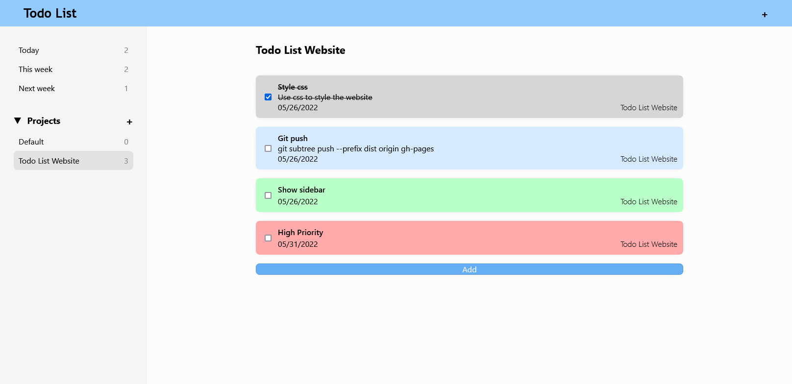
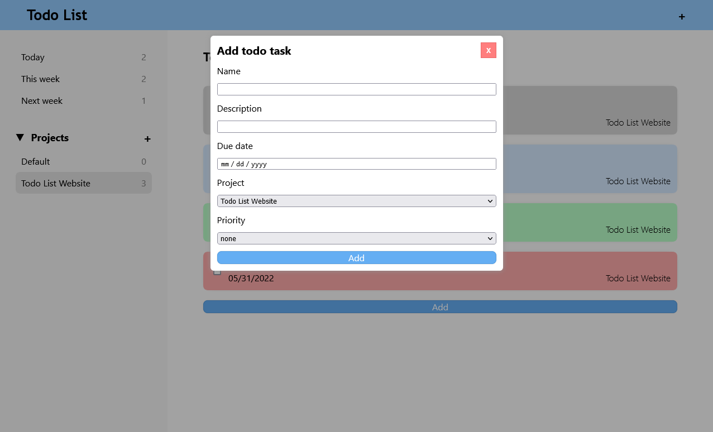
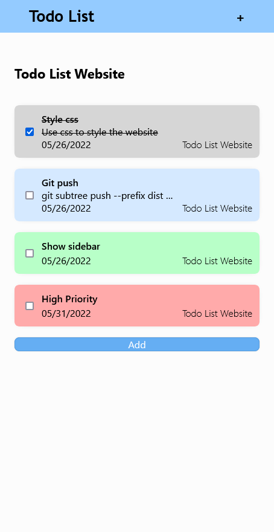

# Todo List website

A website to keep track of todos written in HTML, JS, and CSS.

Create a project and add todo tasks to them.

### Large screen

### Adding a todo task

### Small screen

Created as part of [The Odin Project course](https://www.theodinproject.com/).